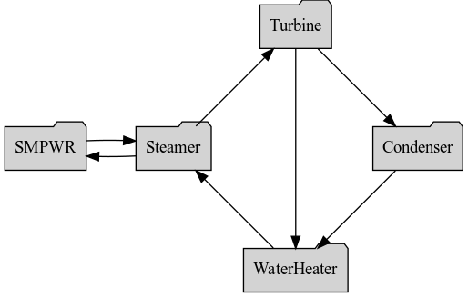

# [SciPy Conference 2021](https://www.scipy2021.scipy.org/)

Second online conference; July 14-16 2021.

View the poster on `NBViewer`:  
 
Execute the poster on `Binder`: 

[**Design of a Balance of Plant System with Dynamic Networks**](https://www.scipy2021.scipy.org/virtual-poster-session)

 >[Nik Kemper](https://github.com/NikolausKemper), [Jack Kennedy](https://github.com/jjfk99) and [Valmor F. de Almeida](https://github.com/dealmeidavf)  
 >[Dept. of Chemical Engineering (Nuclear Energy)](https://www.uml.edu/Engineering/Chemical/faculty/de-Almeida-Valmor.aspx)  
 >University of Massachusetts Lowell, USA  

|  |
|---|
| |
| 
<b>Balance of plant network. System-level dynamic simulation using the Python library [`Cortix`](https://cortix.org).</b>
 |

References:
- J. Kennedy, N. Kemper, V. F. de Almeida, [Engy-4390: Small Modular Pressurized Water Reactor](https://github.com/dpploy/engy-4390/tree/main/projects/sm-pwr).
- Dale Atkinson, “NuScale update for NASEO” Nuscale power, May 2019. Retrieved at:https://naseo.org/Data/Sites/1/atkinson_naseo-may-22,-2019.pdf 
- V. F. de Almeida, [Cortix](https://cortix.org), *Network Dynamics Simulation*, University of Massachusetts Lowell, Dept. of Chemical Engineering (Nuclear program).
- V. F. de Almeida, [*Engy-4350: Nuclear Reactor Engineering*](https://github.com/dpploy/engy-4350), University of Massachusetts Lowell, Dept. of Chemical Engineering (Nuclear Program).
- NuScale, "NuScale Standard PlantDesign Certification Application, Chapter Four, Reactor, Revision 5", July 2020.Retrieved at:https://www.nrc.gov/docs/ML2022/ML20224A492.pdf
- NuScale, "NuScale Standard PlantDesign Certification Application, Chapter Five, Reactor Coolant Systems and Connecting Systems, Revision 5", July 2020.Retrieved at:https://www.nrc.gov/docs/ML2022/ML20224A493.pdf
- NuScale, "NuScale Standard PlantDesign Certification Application, Chapter Ten, Steam and Power Conversion System, Revision 5", July 2020.Retrieved at:https://www.nrc.gov/docs/ML2022/ML20224A499.pdf
